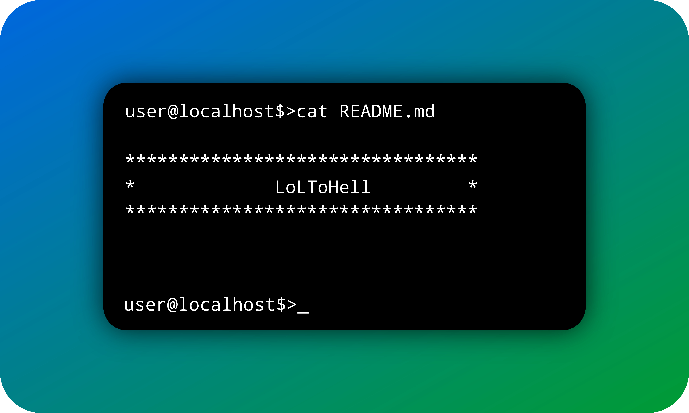

<html>
  <body background="assets/images/background.jpg">

  
 

  
 

 <h3> Hello there, i'm LoLToHell  </h3> 
<h5> About me: </h5>
Student, Java and Kotlin programmer. AOSP and Linux-kernel dev, Android firmware and application tester; in my free time I listen to music or read books.  
- 🧑‍💻 Learning Java/Kotlin/C++.  
<h5> You can subscribe to me or write to me in one of the social networks: </h5>

 

If you want to have fun with programming... Never program! ©Me  
«C++» just a disgusting programming language, these warnings, errors... But no, it's just me a stupid bastard who, as usual, forgot to put a ";" ©Me  

  

 

  

  

    
    
    
    
    
    
    
    
    
    
    
    
    
    
    
    
    
    
    
    
    
    
    
    
    
    
    
    
    
 

   </body>
</html>
